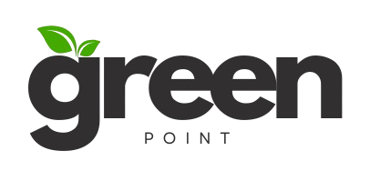
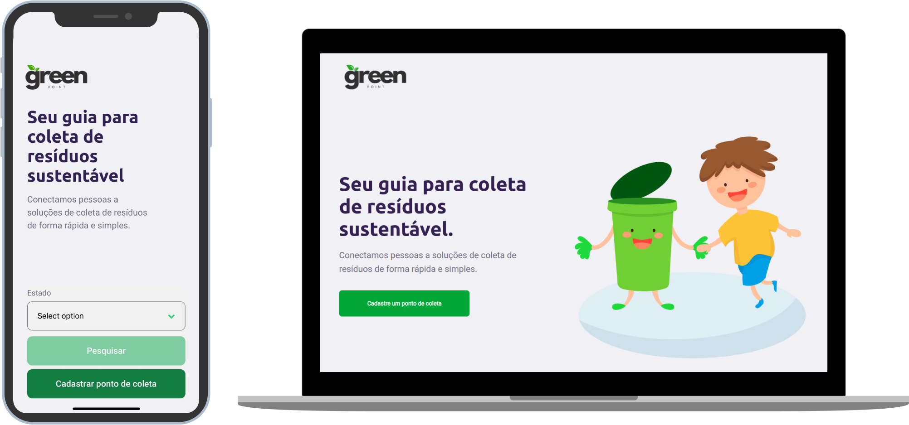

<h1 align="center">
    
</h1>

  <a href="#tecnologias">Tecnologias</a>&nbsp;&nbsp;&nbsp;|&nbsp;&nbsp;&nbsp;
  <a href="#-projeto">Projeto</a>&nbsp;&nbsp;&nbsp;|&nbsp;&nbsp;&nbsp;
  <a href="#memo-licença">Licença</a>

 

  

 

  

## Tecnologias

Esse projeto foi desenvolvido com as seguintes tecnologias:

- [Node.js](https://nodejs.org/en/)
- [React](https://reactjs.org)
- [React Native](https://facebook.github.io/react-native/)
- [Expo](https://expo.io/)

## Projeto

Green Point é o seu guia para coleta de resíduos sustentável. Conectamos pessoas a soluções de coleta de resíduos de forma rápida e simples.

## :memo: Licença

Esse projeto está sob a licença MIT. Veja o arquivo [LICENSE](LICENSE.md) para mais detalhes.
